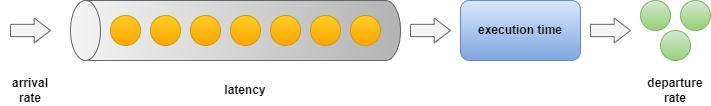

# Queuing Theory for Software Engineers

- Capacity planning -> from DAU to throughput
- Predicting software performance with Little's Law
- Monitoring Queues
- Traffic shaping with Queues

## Exec Summary
Queues are a built-in mechanism everywhere in today's software. Not being familiar with the basics of queuing theory will prevent you from understanding the relations between latency & throughput, high-level capacity estimations, and workload optimization. Knowing the internals of queuing models is actually not that hard to grasp. In this article, I'll sum up the essence of what's required for a software engineer to be more effective in their field.

### Interesting Use-Cases Why????

### Queues Are Everywhere!
- Fork-join pool with work-stealing mechanism
- Java thread pools & unbounded queues
- Scylla DB?

## The Basics
Let's cover the basic concepts first before we discuss practical applications. What are the key metrics that are in play, when we're investigating a queue? We have the following relevant metrics when talking about queues in general.

- Arrival rate: The rate at which new work items arrive in the queue. 
- Latency: 

## Capacity Planning: From DAU to Throughput

# References
- https://en.wikipedia.org/wiki/Kendall%27s_notation
- http://elearning.kocw.net/document/lec/2012/JoongAng/ChaHoonSang/7.pdf
- http://elearning.kocw.net/document/lec/2012/JoongAng/ChaHoonSang/8.pdf
- https://qmodels.readthedocs.io/en/latest/mm1.html
- https://www.youtube.com/watch?v=12XbrjiZ1FA
- https://github.com/miguelrizzog96/Queue_Simulation_Python/blob/master/server.ipynb
- https://notebook.community/xunilrj/sandbox/courses/IMTx-Queue-Theory/Week2_Lab_MM1
- https://github.com/eveneveno/MMC_queue
- https://github.com/miguelrizzog96/Queue_Simulation_Python

## Distributions
- https://numpy.org/doc/stable/reference/random/generated/numpy.random.exponential.html

## Numpy
- https://numpy.org/doc/stable/user/basics.creation.html
