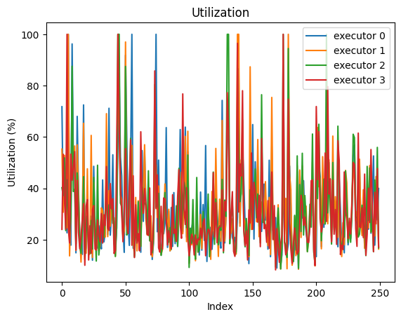

# Queue Model in Python

## Sneak and Peak





## Things that it can do
- [chaining queues](chaning.ipynb)
- [various distribution on the arrival side](simulating-mdc-queues.ipynb)
- [D/D/c queues](simulating-ddc-queues.ipynb)
- [multiple executors](simulating-mdc-queues.ipynb)
- [interesting experiments](interesting-experiments.ipynb)

# Starting the Examples
Installing the environment with [`pyenv`](https://github.com/pyenv/pyenv)
```shell
pyenv activate plotter-3.12
python -m venv .venv
.venv/bin/pip install -r ./requirements-dev.txt
```

Starting the example notebooks
```shell
. .venv/bin/activate
jupyter lab
```
