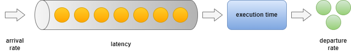

# Queuing Theory for Software Engineers

- Capacity planning -> from DAU to throughput
- Predicting software performance with Little's Law
- Monitoring Queues
- Traffic shaping with Queues

## Exec Summary

## The Basics
Let's cover the basic concepts first before we discuss practical applications. What are the key metrics that are in play, when we're investigating a queue? We have the following relevant metrics when talking about queues in general.

- Arrival rate: The rate at which new work items arrive in the queue. 
- 

## Capacity Planning: From DAU to Throughput
