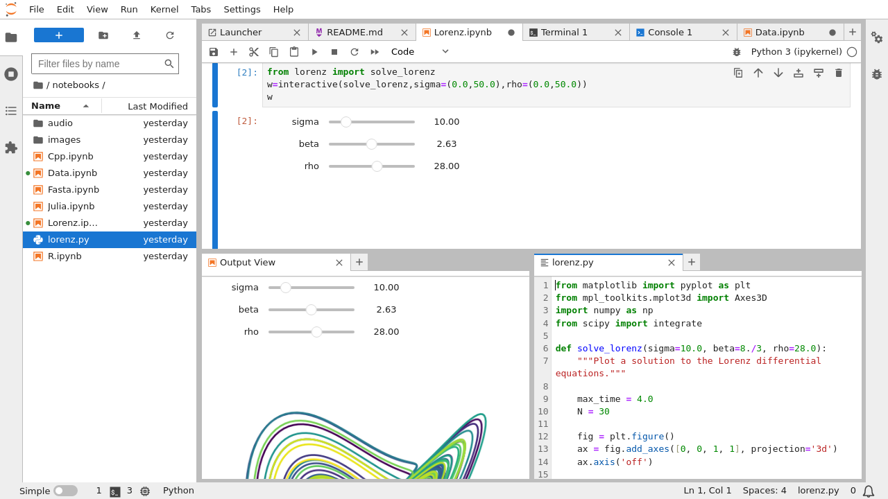

- [x] Import as module
- [x] Install librarires
- [ ] Add sliders
https://jupyterlab.readthedocs.io/en/stable/index.html

- [ ] Gradual typing (mypy)
- [x] Using numpy arrays
- [x] Using floating point arrival times
- [ ] Multiple executors
- [ ] Utilization calculation

